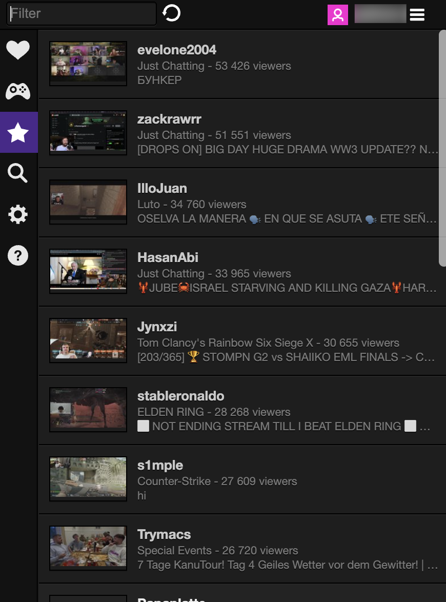

# Twitch Now

> [!NOTE]
> This is a minimal fork of the original [Twitch Now](https://github.com/Ndragomirov/twitch-now) extension to migrate it to work with Chrome Manifest V3. Only Chrome is supported, and it's possible some of the features outside of the core functionality do not work. The code was migrated by Claude Code.



## Installing

Download the repository and unzip it. Then navigate to `chrome://extensions/` in your browser and enable developer mode. Click on "Load unpacked" and select the `build/chrome` directory.

Open the extension and click on Login.

## Development

Install dependencies:
```
$ npm install
```

Build:
```
$ npx gulp chrome
```

Then navigate to `chrome://extensions/` in your browser and enable developer mode. Click on "Load unpacked" and select the `build/chrome` directory.